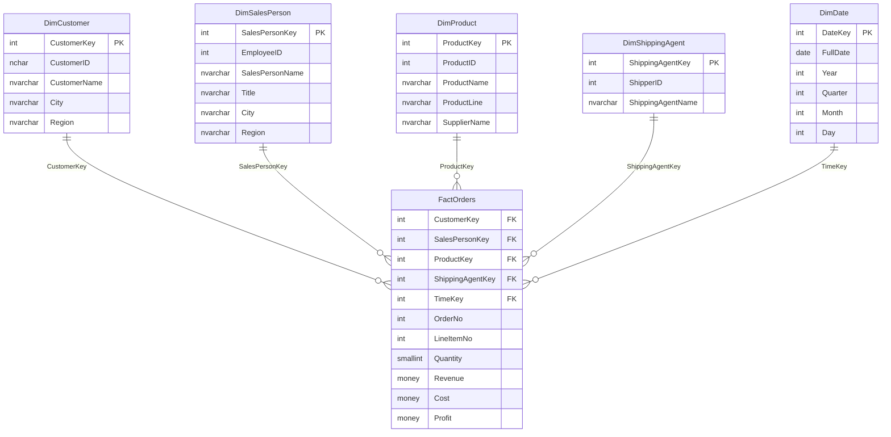

# NorthWindBI

## Información Académica

**UNIVERSIDAD AUTÓNOMA "GABRIEL RENÉ MORENO"**
FACULTAD DE INGENIERÍA EN CIENCIAS DE LA COMPUTACIÓN Y TELECOMUNICACIONES
"SCHOOL OF ENGINEERING"

### Programa
**MAESTRÍA EN CIENCIA DE DATOS E INTELIGENCIA ARTIFICIAL**

### Módulo 4
Data Management and Business Intelligence

### Docente
MSc. Juan Marcelo Claure Salinas

### Integrantes
- Daniel Abasto
- Edmundo Triguero
- Carolina Jaksic Vaca Diez
- Rodolfo Rafael Wayar Tateishi

---

## Descripción del Proyecto

Proyecto de Business Intelligence basado en la base de datos NorthWind

### Estado Actual
- [x] Estructura del proyecto (SQL Server Data Tools) (NorthWindOLTP)
- [x] 13 tablas del modelo OLTP definidas
- [x] Estructura del proyecto Data Warehouse (NorthWindDW)
- [x] Esquema Estrella implementado (5 dimensiones + 1 tabla de hechos)
- [x] Stored Procedures para ETL (MERGE y CDC)
- [x] ETL con SSIS (NorthWindETL)
- [x] Modelo OLAP con SSAS (NorthWindOLAP)

### Tecnologías
- SQL Server 2025 Enterprise Developer Edition (17.0)
- Visual Studio 2026
- SQL Server Data Tools (SSDT)
- SQL Server Integration Services (SSIS)
- SQL Server Analysis Services (SSAS) Tabular

---

## Requerimientos de Negocio

### 1. Performance de las Ventas
> La Gerencia desea saber el rendimiento de las ventas de las distintas sucursales en las gestiones.

**Área solicitante:** Gerencia General
**Dimensiones involucradas:** DimDate, DimSalesPerson (Ciudad/Región como sucursal)
**Métricas:** Revenue, Quantity, Profit
**Análisis esperado:** Comparativo de ventas por sucursal (ciudad/región del vendedor) a través del tiempo, identificando tendencias y variaciones entre gestiones.

### 2. Performance del Producto
> La Gerencia desea saber qué productos tienen mayor demanda para poder incrementar la disponibilidad en stock dependiendo de las necesidades del cliente.

**Área solicitante:** Gerencia General
**Dimensiones involucradas:** DimProduct (ProductName, ProductLine, SupplierName), DimDate
**Métricas:** Quantity, Revenue
**Análisis esperado:** Ranking de productos por demanda y línea de producto, identificando los más vendidos para optimizar niveles de inventario y disponibilidad.

### 3. Evaluación del Personal de Ventas
> El departamento de RRHH desea tener una instancia de las ventas realizadas por los empleados para evaluar su desempeño en la empresa.

**Área solicitante:** Recursos Humanos
**Dimensiones involucradas:** DimSalesPerson (SalesPersonName, Title, HireDate), DimDate
**Métricas:** Revenue, Quantity, Profit
**Análisis esperado:** Evaluación del desempeño individual de cada vendedor, incluyendo volumen de ventas, ingresos generados y evolución en el tiempo desde su contratación.

### 4. Preferencias del Cliente
> El departamento de Marketing desea saber qué clientes son los que más compran y su fidelidad respecto al tiempo.

**Área solicitante:** Marketing
**Dimensiones involucradas:** DimCustomer (CustomerName, City, Country), DimDate, DimProduct
**Métricas:** Revenue, Quantity, frecuencia de compra
**Análisis esperado:** Segmentación de clientes por volumen de compra, identificación de clientes top, análisis de fidelidad y recurrencia de compras a lo largo del tiempo.

### 5. Comportamiento de la Distribución
> El área de Distribución quiere conocer las características y beneficios de trabajar con las Empresas de Transporte.

**Área solicitante:** Distribución / Logística
**Dimensiones involucradas:** DimShippingAgent (ShippingAgentName), DimDate, DimCustomer (Country, Region)
**Métricas:** Quantity (volumen de envíos), Revenue
**Análisis esperado:** Evaluación comparativa de las empresas de transporte, volumen de pedidos gestionados por cada una, cobertura geográfica y contribución al negocio.

---

## Arquitectura del Data Warehouse

### Esquema Estrella (Star Schema)

El Data Warehouse implementa un **modelo dimensional** con granularidad a nivel de línea de pedido (Order Line Item).

### Componentes del Data Warehouse

| Componente | Descripción |
|------------|-------------|
| **FactOrders** | Tabla de hechos con métricas de ventas (Quantity, Revenue, Cost, Profit) |
| **DimCustomer** | Dimensión de clientes |
| **DimSalesPerson** | Dimensión de empleados/vendedores |
| **DimProduct** | Dimensión de productos (desnormalizada con categoría y proveedor) |
| **DimShippingAgent** | Dimensión de transportistas |
| **DimDate** | Dimensión de tiempo (1996-1998) |
| **PackageConfig** | Tabla de control para ETL incremental (CDC) |
| **staging.*** | Tablas intermedias para carga ETL |

### Stored Procedures

- **DW_Merge*** - Procedimientos para actualizar dimensiones y hechos (SCD Type 1)
- **GetLastPackageRowVersion** - Obtener última versión procesada por ETL
- **UpdateLastPackageRowVersion** - Actualizar versión procesada
