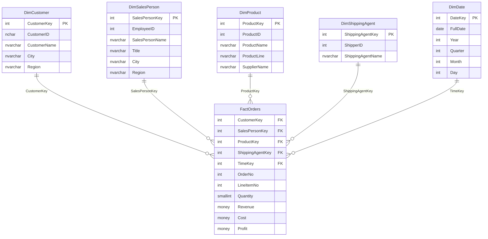

# NorthWindBI

## Información Académica

**UNIVERSIDAD AUTÓNOMA "GABRIEL RENÉ MORENO"**
FACULTAD DE INGENIERÍA EN CIENCIAS DE LA COMPUTACIÓN Y TELECOMUNICACIONES
"SCHOOL OF ENGINEERING"

### Programa
**MAESTRÍA EN CIENCIA DE DATOS E INTELIGENCIA ARTIFICIAL**

### Módulo 4
Data Management and Business Intelligence

### Docente
MSc. Juan Marcelo Claure Salinas

### Integrantes
- Daniel Abasto
- Edmundo Triguero
- Carolina Jaksic Vaca Diez
- Rodolfo Rafael Wayar Tateishi

---

## Descripción del Proyecto

Proyecto de Business Intelligence basado en la base de datos NorthWind

### Estado Actual
- [x] Estructura del proyecto (SQL Server Data Tools) (NorthWindOLTP)
- [x] 13 tablas del modelo OLTP definidas
- [x] Estructura del proyecto Data Warehouse (NorthWindDW)
- [x] Esquema Estrella implementado (5 dimensiones + 1 tabla de hechos)
- [x] Stored Procedures para ETL (MERGE y CDC)
- [x] ETL con SSIS (NorthWindETL)
- [ ] Modelo OLAP con SSAS (NorthWindOLAP)

### Tecnologías
- SQL Server 2025 Enterprise Developer Edition (17.0)
- Visual Studio 2026
- SQL Server Data Tools (SSDT)
- SQL Server Integration Services (SSIS)
- SQL Server Analysis Services (SSAS) Tabular

---

## Arquitectura del Data Warehouse

### Esquema Estrella (Star Schema)

El Data Warehouse implementa un **modelo dimensional** con granularidad a nivel de línea de pedido (Order Line Item).

### Componentes del Data Warehouse

| Componente | Descripción |
|------------|-------------|
| **FactOrders** | Tabla de hechos con métricas de ventas (Quantity, Revenue, Cost, Profit) |
| **DimCustomer** | Dimensión de clientes |
| **DimSalesPerson** | Dimensión de empleados/vendedores |
| **DimProduct** | Dimensión de productos (desnormalizada con categoría y proveedor) |
| **DimShippingAgent** | Dimensión de transportistas |
| **DimDate** | Dimensión de tiempo (1996-1998) |
| **PackageConfig** | Tabla de control para ETL incremental (CDC) |
| **staging.*** | Tablas intermedias para carga ETL |

### Stored Procedures

- **DW_Merge*** - Procedimientos para actualizar dimensiones y hechos (SCD Type 1)
- **GetLastPackageRowVersion** - Obtener última versión procesada por ETL
- **UpdateLastPackageRowVersion** - Actualizar versión procesada
